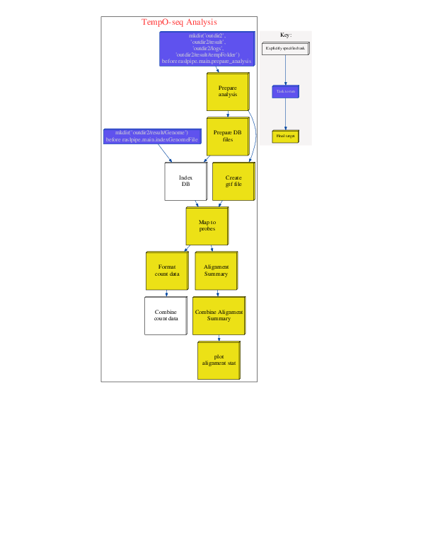

===============
Pipeline Stages
===============

Documentation of each stage of the pipeline including all of the output files generated and how they are used

.. toctree::
    :maxdepth: 1

    prepareDB_file
    indexGenomeFile
    create_gtf_file
    map_to_probes
    format_count_data
    combine_count_data
    alignment_summary
    combine_alignment_summary
    plot_alignment_summary
